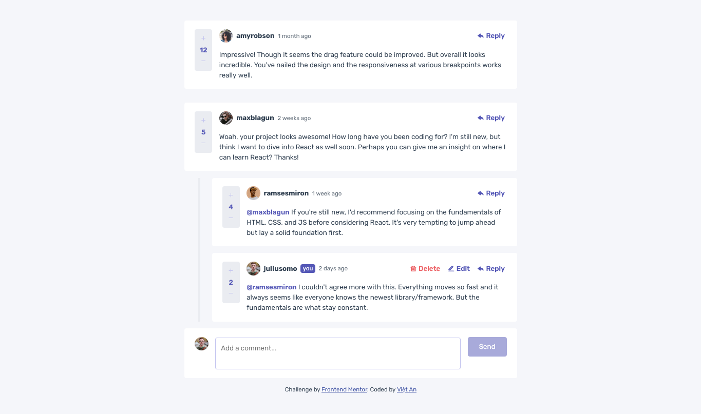

# Frontend Mentor - Interactive comments section solution

This is a solution to the [Interactive comments section challenge on Frontend Mentor](https://www.frontendmentor.io/challenges/interactive-comments-section-iG1RugEG9). Frontend Mentor challenges help you improve your coding skills by building realistic projects. 

## Table of contents

- [Overview](#overview)
  - [The challenge](#the-challenge)
  - [Screenshot](#screenshot)
  - [Links](#links)
- [My process](#my-process)
  - [Built with](#built-with)
  - [What I learned](#what-i-learned)
  - [Continued development](#continued-development)
  - [Useful resources](#useful-resources)
- [Author](#author)
- [Acknowledgments](#acknowledgments)

## Overview

### The challenge

Users should be able to:

- View the optimal layout for the app depending on their device's screen size
- See hover states for all interactive elements on the page
- Create, Read, Update, and Delete comments and replies
- Upvote and downvote comments

### Screenshot

- [Solution Page on Frontend Mentor](https://www.frontendmentor.io/solutions/interactive-comments-section-using-react-and-sass-_A4t89MEie)
- [Live Website](https://fm-interactive-comments-sect-vietan0.netlify.app/)

## My process

### Built with

- [React](https://reactjs.org/)
- [Sass](https://sass-lang.com/documentation/)
- Semantic HTML5 markup
- Flexbox

## Author

-   Frontend Mentor - [@vietan0](https://www.frontendmentor.io/profile/vietan0)
-   Linkedin - [@vietan](https://www.linkedin.com/in/vietan/)
